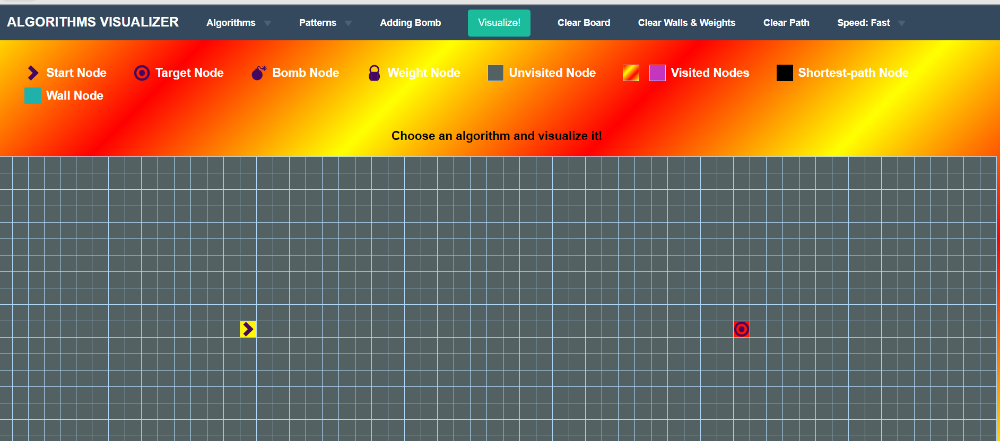
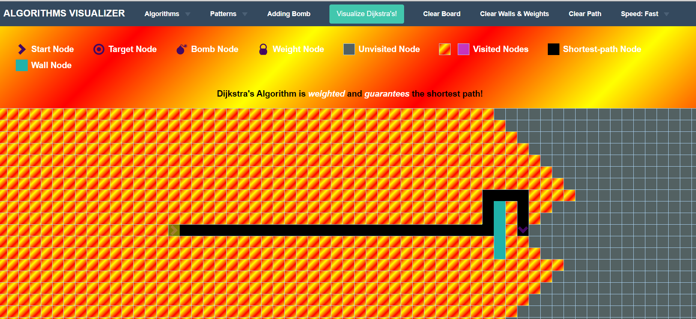
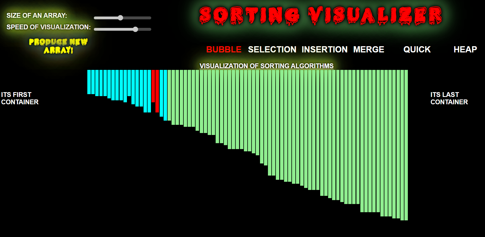
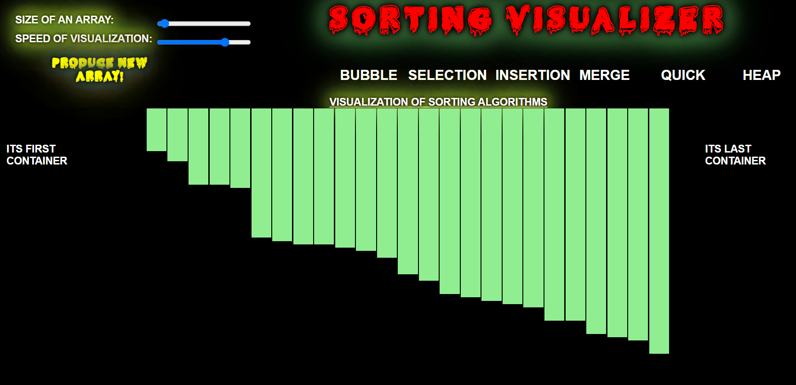

  

# ALGORIHMS-VIUALIZER-PART :star_struck:

***This new Web application is created by Biswarup Bhattacharjee, student of BTECH, in University of Engineering and Management, Kolkata.***

**Email Id: bbiswa471@gmail.com.** 

**Contact No: 916290272740.** 

 

## About :point_down: 
*It is the functionality 1 of my project.* Algorithm Visualizer is an online platform that visualizes algorithms from as per user choice. Algorithm-visualizer is a web app written in React. It contains UI components and interprets commands into visualizations. Here are two types of algorithms, searching and sorting. Here user will get a tutorial for using this web application. Here we can set the size, speed, name of algorithm them it will show how the algorithm actually works.
## LINK of full project: :point_right:https://algo-visualize-login-signup.vercel.app/login
## Purpose :point_down:
I have made this to make learning algorithms an interesting, facsinating and easy work. 
## Use :point_down:
Clicking on Visualize Algorithms user can see searching visualizer and there in the drop down menu user has to choose sorting algorithms to watch and understand working of some specific algorithms. User can read the tutorial which describes how to use that web application. User can change the values to see different working way.
## Importance :point_down:
 Learning an algorithm gets much easier with visualizing it. So it is a great way to study and understand algotihms.
## Making :point_down:
It has been created using advance JavaScript, advance CSS3, SCSS, ReactJS, advance HTML5, Vercel, Firebase, Chat Engine XDK, nodejs and Formik. It is fully responsive. For references for algorithms I have used [geeksforgeeks](https://www.geeksforgeeks.org/) and [wikipedia](https://www.wikipedia.org/). For all custom images in algorithms part I have used [photoshop](www.adobe.com/Adobe/Photoshop). In discussion part for chatting I have used [chat engine](https://chatengine.io/).
## Screenshots :point_down: 

 

 

 

 
 

