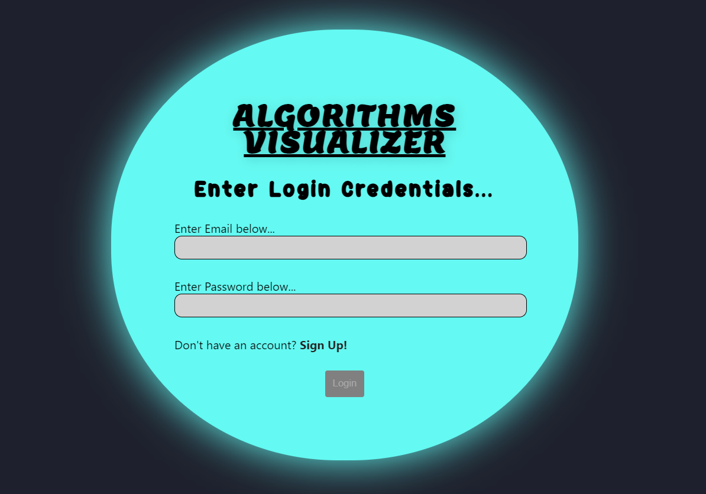
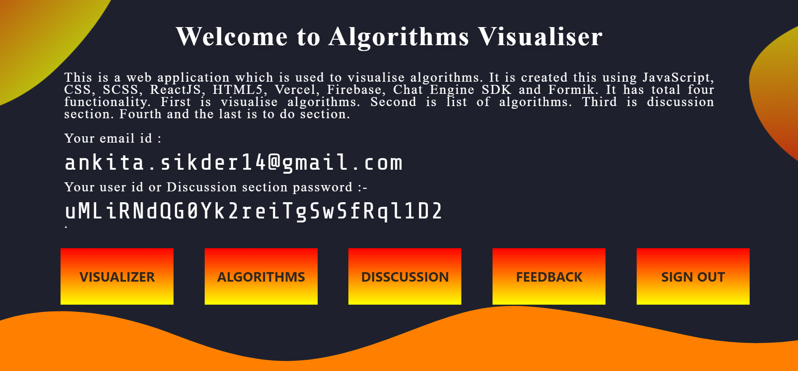
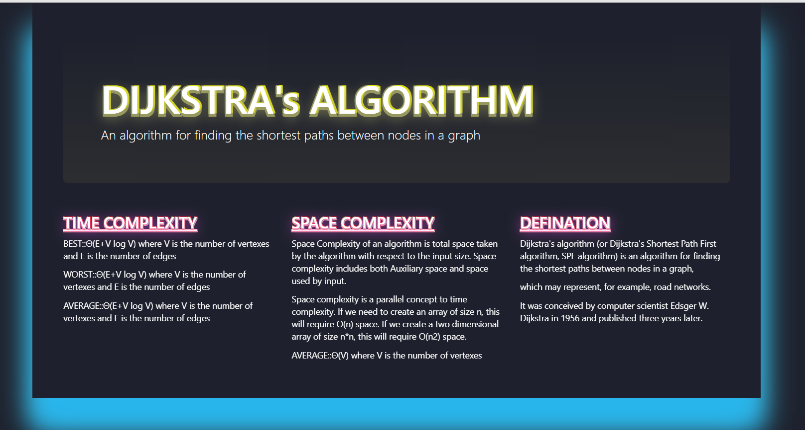

  

# ALGORIHMS-PART :star_struck:

***This new Web application is created by Biswarup Bhattacharjee, student of BTECH, in University of Engineering and Management, Kolkata.***

**Email Id: bbiswa471@gmail.com.** 

**Contact No: 916290272740.** 

 

## About :point_down: 
*It is the 2nd functionality of my project.* In mathematics and computer science, an algorithm is a finite sequence of well-defined, computer-implementable instructions, typically to solve a class of problems or to perform a computation. Algorithms are always unambiguous and are used as specifications for performing calculations, data processing, automated reasoning, and other tasks. As an effective method, an algorithm can be expressed within a finite amount of space and time, and in a well-defined formal language for calculating a function. This part provides 72 cards containing details of different algorithms. Here are 3 types of algorithms, searching, sorting and others.
## LINK : :point_right:https://algo-visualize-algorithms.netlify.app/
## Purpose :point_down:
I have made this to make learning algorithms an interesting, facsinating and easy work. 
## Use :point_down:
Clicking on Algorithms user can see 72 cards of different algorithms. When user clicks on "learn more" in card a page opens showing time complexity, space complexity, definitions etc details.
## Importance :point_down:
 Learning an algorithm gets much easier with getting compact details without searching in goolge or in any book. So it is a great way to study and understand algotihms.
## Making :point_down:
It has been created using advance JavaScript, advance CSS3, SCSS, ReactJS, advance HTML5, Vercel, Firebase, Chat Engine XDK, nodejs and Formik. It is fully responsive. For references for algorithms I have used [geeksforgeeks](https://www.geeksforgeeks.org/) and [wikipedia](https://www.wikipedia.org/). For all custom images in algorithms part I have used [photoshop](www.adobe.com/Adobe/Photoshop). 
## Screenshots :point_down: 

 
 

 

 

## Available Scripts

In the project directory, you can run:

### `yarn start`

Runs the app in the development mode.\
Open [http://localhost:3000](http://localhost:3000) to view it in the browser.

The page will reload if you make edits.\
You will also see any lint errors in the console.

### `yarn test`

Launches the test runner in the interactive watch mode.\
See the section about [running tests](https://facebook.github.io/create-react-app/docs/running-tests) for more information.

### `yarn build`

Builds the app for production to the `build` folder.\
It correctly bundles React in production mode and optimizes the build for the best performance.

The build is minified and the filenames include the hashes.\
Your app is ready to be deployed!

See the section about [deployment](https://facebook.github.io/create-react-app/docs/deployment) for more information.

### `yarn eject`

**Note: this is a one-way operation. Once you `eject`, you can’t go back!**

If you aren’t satisfied with the build tool and configuration choices, you can `eject` at any time. This command will remove the single build dependency from your project.

Instead, it will copy all the configuration files and the transitive dependencies (webpack, Babel, ESLint, etc) right into your project so you have full control over them. All of the commands except `eject` will still work, but they will point to the copied scripts so you can tweak them. At this point you’re on your own.

You don’t have to ever use `eject`. The curated feature set is suitable for small and middle deployments, and you shouldn’t feel obligated to use this feature. However we understand that this tool wouldn’t be useful if you couldn’t customize it when you are ready for it.

## Learn More

You can learn more in the [Create React App documentation](https://facebook.github.io/create-react-app/docs/getting-started).

To learn React, check out the [React documentation](https://reactjs.org/).

### Code Splitting

This section has moved here: [https://facebook.github.io/create-react-app/docs/code-splitting](https://facebook.github.io/create-react-app/docs/code-splitting)

### Analyzing the Bundle Size

This section has moved here: [https://facebook.github.io/create-react-app/docs/analyzing-the-bundle-size](https://facebook.github.io/create-react-app/docs/analyzing-the-bundle-size)

### Making a Progressive Web App

This section has moved here: [https://facebook.github.io/create-react-app/docs/making-a-progressive-web-app](https://facebook.github.io/create-react-app/docs/making-a-progressive-web-app)

### Advanced Configuration

This section has moved here: [https://facebook.github.io/create-react-app/docs/advanced-configuration](https://facebook.github.io/create-react-app/docs/advanced-configuration)

### Deployment

This section has moved here: [https://facebook.github.io/create-react-app/docs/deployment](https://facebook.github.io/create-react-app/docs/deployment)

### `yarn build` fails to minify

This section has moved here: [https://facebook.github.io/create-react-app/docs/troubleshooting#npm-run-build-fails-to-minify](https://facebook.github.io/create-react-app/docs/troubleshooting#npm-run-build-fails-to-minify)
