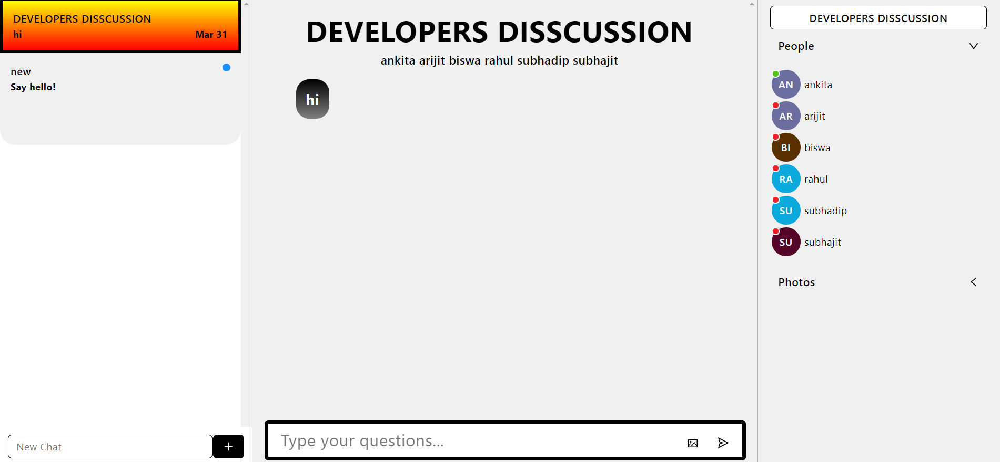

  

# DISCUSSION-PART :star_struck:

***This new Web application is created by Biswarup Bhattacharjee, student of BTECH, in University of Engineering and Management, Kolkata.***

**Email Id: bbiswa471@gmail.com.** 

**Contact No: 916290272740.** 

 

## About :point_down: 
*It is the 3rd functionality of my project.* The DISCUSSION part will take the user to a login page where he has to give username and password (firebase-provided password in home page). Then he will be added in a discussion group for doubt clearing where I will answer his questions regarding this website. Here user can send messages and images in chat.
## LINK : :point_right: https://algo-visualize-disscussion.netlify.app/
## Purpose :point_down:
The purpose of the discussion is to interpret and describe the significance of your findings in light of what was already known about the research problem being investigated and to explain any new understanding or insights that emerged as a result of your study of the problem. I have made this to make study easier.
## Use :point_down:
Click on discussions. Here user has to enter his username and password (firebase-provided password in home page). Then he will be added in a discussion group for doubt clearing where the developers will answer his questions regarding this website. 
## Importance :point_down:
Discussion is important for any queries of user. When developers guide the user properly it will very helpful for the user to explore the web site and study algorithms.
## Making :point_down:
It has been created using advance JavaScript, advance CSS3, SCSS, ReactJS, advance HTML5, Firebase, Chat Engine XDK, nodejs and Formik. It is fully responsive. For references for algorithms I have used [geeksforgeeks](https://www.geeksforgeeks.org/) and [wikipedia](https://www.wikipedia.org/). 
## Screenshots :point_down: 

 
 

 

