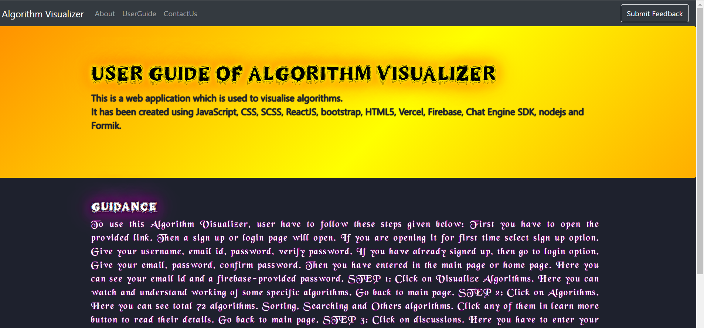
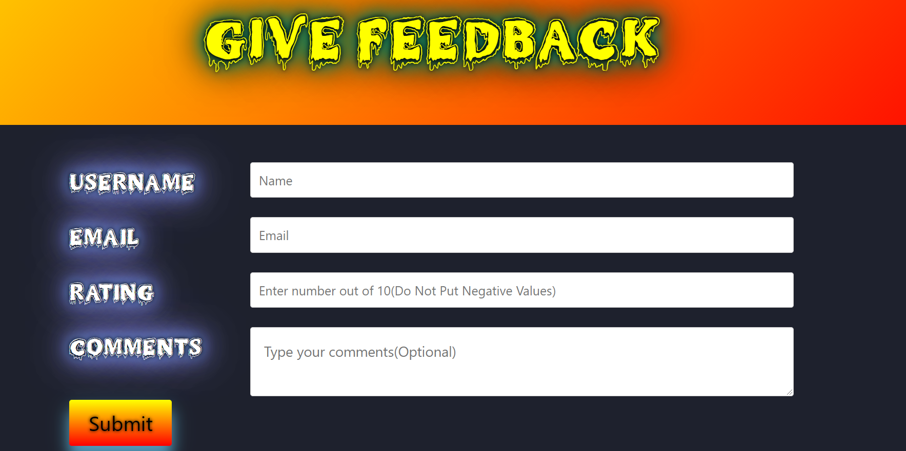

# FEEDBACK-PART :star_struck: :chart_with_upwards_trend: :clipboard: :computer:

[](https://shields.io/) [](https://shields.io/) [](https://shields.io/) [](https://shields.io/) [](https://shields.io/) 

***This new Web application is created by Biswarup Bhattacharjee, student of BTECH, in University of Engineering and Management, Kolkata.***

**Email Id: bbiswa471@gmail.com.** 

**Contact No: 916290272740.** 


<p align="left">
<a href="https://facebook.com/biswarup.bhattacharjee.5811" target="blank"></a>
<a href="https://instagram.com/biswarup2210" target="blank"></a>
<a href="https://github.com/biswa2210/biswa2210" target="blank"></a>
</p>

## About :point_down: 

<div align="justified">
            
*It is the 4 th functionality of my project.* Website feedback is information obtained directly from website users—through on-page surveys, feedback widgets, and other techniques—to help organizations understand what people think (and how they feel) about their websites and landing pages. It has 4 pages containing algorithms visualizer overview, about the 4 functionalities, userguide, contact us portion. There is also an option to send feedback about this web application.
</div>

## LINK : :point_right: https://algo-visualize-feedback.netlify.app/

## Purpose :point_down:

<div align="justified">
            
I have added this section because here user can read about this web application, user guide which will be helpful for him. I have given feedback area so that user can write to me about my algo visualizer project. User's feedback is important to me because only in this way I can know how I should make my work more advance.
</div>
## Use :point_down:

Clicking on feedback user can read about my web app. User can write about how much this website is useful or any idea for improvement in this website in contact us section. In send feedback portion user can give feedback.

## Importance :point_down:

User's feedback is important to me because only in this way I can know how I should make my work more advance. I can understand if my web app is helpful to users or not.

## Folder Structure :point_down:

```bash
Functionality4
     └── feedback
            ├── public
            |     ├── index.html
            ├── src
            |     ├── components
            |     |     └── Navbar.js
            |     ├── fonts
            |     └── pages
            |           ├── About.js
            |           ├── Contact.js
            |           ├── home.js
            |           ├── Userguide.js
            |           ├── feedback.js
            |           └── err404.js
            ├── service
            |     └── firebase.js
            ├── App.js
            ├── App.css
            ├── index.js
            └── index.css
```
## Making :point_down:

It has been created using advance JavaScript, advance CSS3, SCSS, ReactJS, advance HTML5, Firebase, Chat Engine XDK, nodejs and Formik. It is fully responsive. 

## Screenshots :point_down: 
<div align="center">
 
 

 

 

 


</div>

## Available Scripts

In the project directory, you can run:

### `yarn start`

Runs the app in the development mode.\
Open [http://localhost:3000](http://localhost:3000) to view it in the browser.

The page will reload if you make edits.\
You will also see any lint errors in the console.

### `yarn test`

Launches the test runner in the interactive watch mode.\
See the section about [running tests](https://facebook.github.io/create-react-app/docs/running-tests) for more information.

### `yarn build`

Builds the app for production to the `build` folder.\
It correctly bundles React in production mode and optimizes the build for the best performance.

The build is minified and the filenames include the hashes.\
Your app is ready to be deployed!

See the section about [deployment](https://facebook.github.io/create-react-app/docs/deployment) for more information.

### `yarn eject`

**Note: this is a one-way operation. Once you `eject`, you can’t go back!**

If you aren’t satisfied with the build tool and configuration choices, you can `eject` at any time. This command will remove the single build dependency from your project.

Instead, it will copy all the configuration files and the transitive dependencies (webpack, Babel, ESLint, etc) right into your project so you have full control over them. All of the commands except `eject` will still work, but they will point to the copied scripts so you can tweak them. At this point you’re on your own.

You don’t have to ever use `eject`. The curated feature set is suitable for small and middle deployments, and you shouldn’t feel obligated to use this feature. However we understand that this tool wouldn’t be useful if you couldn’t customize it when you are ready for it.

## Learn More

You can learn more in the [Create React App documentation](https://facebook.github.io/create-react-app/docs/getting-started).

To learn React, check out the [React documentation](https://reactjs.org/).

### Code Splitting

This section has moved here: [https://facebook.github.io/create-react-app/docs/code-splitting](https://facebook.github.io/create-react-app/docs/code-splitting)

### Analyzing the Bundle Size

This section has moved here: [https://facebook.github.io/create-react-app/docs/analyzing-the-bundle-size](https://facebook.github.io/create-react-app/docs/analyzing-the-bundle-size)

### Making a Progressive Web App

This section has moved here: [https://facebook.github.io/create-react-app/docs/making-a-progressive-web-app](https://facebook.github.io/create-react-app/docs/making-a-progressive-web-app)

### Advanced Configuration

This section has moved here: [https://facebook.github.io/create-react-app/docs/advanced-configuration](https://facebook.github.io/create-react-app/docs/advanced-configuration)

### Deployment

This section has moved here: [https://facebook.github.io/create-react-app/docs/deployment](https://facebook.github.io/create-react-app/docs/deployment)

### `yarn build` fails to minify

This section has moved here: [https://facebook.github.io/create-react-app/docs/troubleshooting#npm-run-build-fails-to-minify](https://facebook.github.io/create-react-app/docs/troubleshooting#npm-run-build-fails-to-minify)


