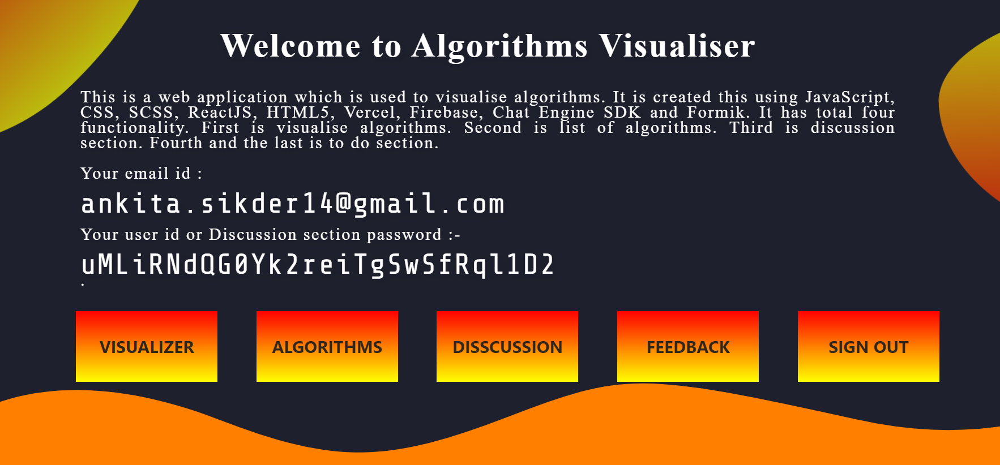
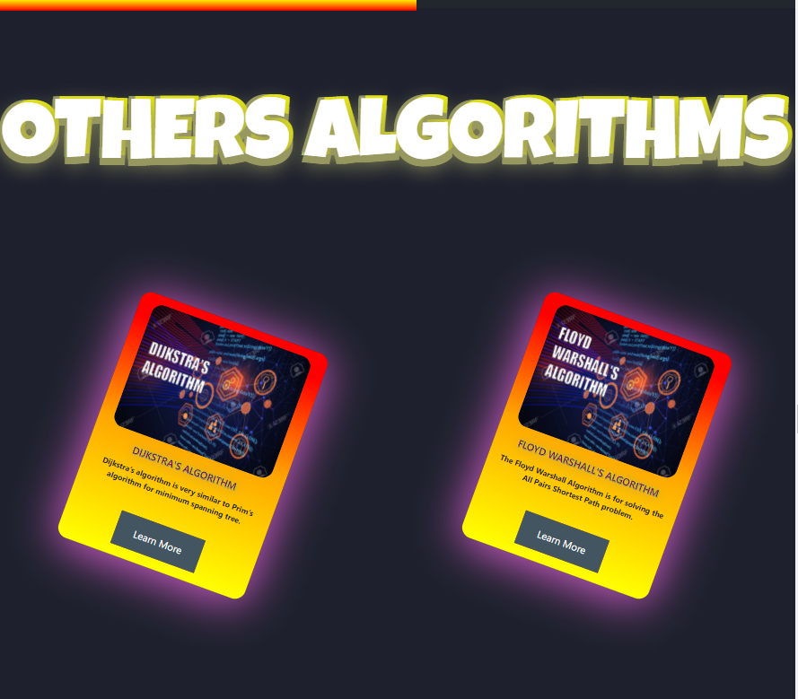
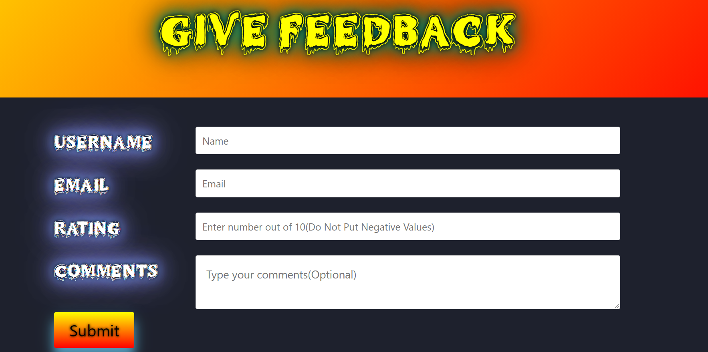
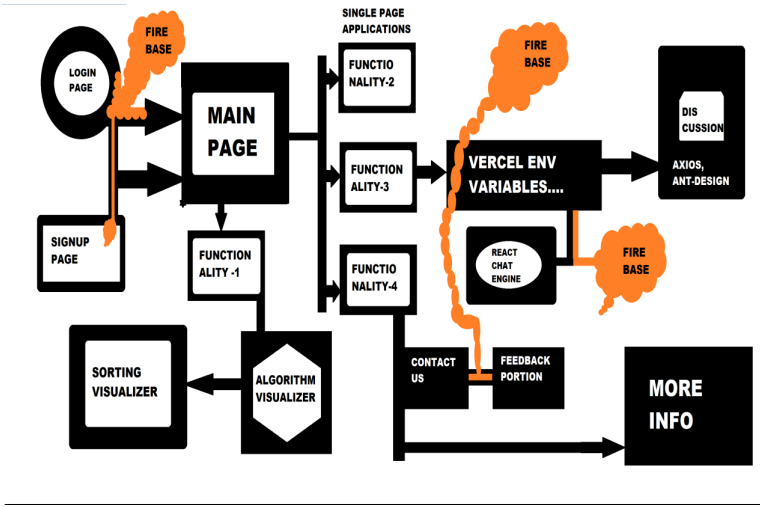

# ALGORITHMS-VIUALIZER-WEB-APPLICATION :star_struck: 

:open_file_folder: :computer: :iphone: :e-mail: :bookmark_tabs: 

[](https://shields.io/) [](https://shields.io/) [](https://shields.io/) [](https://shields.io/) [](https://shields.io/) 
 

***This new Web application names'Alogorithm Visualizer' is created by Biswarup Bhattacharjee, student of BTECH, in University of Engineering and Management, Kolkata.***

**Email Id: bbiswa471@gmail.com.** 

**Contact No: 916290272740.** 

<p align="left">
<a href="https://www.facebook.com/profile.php?id=100070395300810" target="blank"></a>
<a href="https://instagram.com/biswarup2210" target="blank"></a>
<a href="https://github.com/biswa2210/biswa2210" target="blank"></a>
</p>

## About :point_down: 

<div align="justified">
 
**I have made this project but just for group project purpose my class mates' as well as group members' names are written in developers area in research paper.** *This is the project of second year fourth semester*. This is a web application which is used to visualise algorithms. User can approach this website through a provided link. First of all it has a sign up or login page. If user is opening it for first time he has to select sign up option. Here he has to give username, email id, password, verify password. If he has already signed up, then he has to go to login option and then he has to give email, password, confirm password. Then you have entered in the main page or home page. Here user can see your email id and a firebase-provided password. Here four buttons are given. VISUALIZE ALGORITHMS, ALGORITHMS, DISCUSSION, FEEDBACK. By clicking on VISUALIZE ALGORITHMS user can watch and understand working of some specific algorithms. If user goes to ALGORITHMS he can see total _72_ algorithms. Sorting, Searching and Others algorithms. If he clicks any of them in learn more button then their details will be shown in a page. The DISCUSSION part will take the user to a login page where he has to give username and password (firebase-provided password in home page). Then he will be added in a discussion group for doubt clearing where the developers will answer his questions regarding this website. In the feedback portion user can write about how much this website is useful or any idea for improvement in this website in the comment section. **This Web Application is totally responsiove.**
</div>

## Things needed to get started eith this web app :point_down:

 - [x] valid email id
 - [x] username
 - [x] password

**:point_right: [click here to read Project2 Report](https://github.com/biswa2210/PROJECT-2-UEMK/blob/master/4thSemProject2ResearchPaper.pdf)<br>
:point_right: [click here to see Project2 PowerPoint Presentation](https://docs.google.com/presentation/d/1lfq0aNgFIrzmpvoC70VYKoV4YjFzUOIv/edit#slide=id.p1)<br>**

## LINKS :point_down:

***PROJECT--\>https://algo-visualize-login-signup.vercel.app/login<br>
ALGORITHMS PART--\>https://algo-visualize-algorithms.netlify.app/<br>
DISCUSSION PART--\>https://algo-visualize-disscussion.netlify.app/<br>
FEEDBACK PART--\>https://algo-visualize-feedback.netlify.app<br>***

## RESEARCH PAPER PUBLISHED IJRESM :point_down:

The research paper of this project has been published in International Journal of Research in Engineering, Science and Management in 6 th Sept, 2021 in vol 4, issue 9. The name of the research paper is **Web-Based Dynamic Algorithm Visualizer Along with Chat Engine SDK for Neophytes**. I have built the project and all implementation part but for group project purpose there are total 4 authors of this research paper. 

## LINK OF PUBLISHED RESEARCH PAPER :point_down:

**https://journals.resaim.com/ijresm/article/view/1290<br>
https://journals.resaim.com/ijresm/article/view/1290/1234**

## Cirtificate for publishing Research Paper in IJRESM :point_down:

<div align="center">
<a href="pics/cir.PNG"></a>
</div>

## Purpose :point_down:

<div align="justified">
 
Algorithms are used in every part of computer science. They form the field's backbone. In computer science, an algorithm gives the computer a specific set of instructions, which allows the computer to do everything, be it running a calculator or running a rocket. Algorithmic thinking, or the ability to define clear steps to solve a problem, is crucial in many different fields. Even if we’re not conscious of it, we use algorithms and algorithmic thinking all the time. Algorithmic thinking allows students to break down problems and conceptualize solutions in terms of discrete steps. Being able to understand and implement an algorithm requires students to practice structured thinking and reasoning abilities. I have made this website to easily study algorithms.
</div>

## User Guide :point_down:

<div align="justified">
 
To use this Algorithm Visualizer, user have to follow these steps given below:
First you have to open the provided link. Then a sign up or login page will open. If you are opening it for first time select sign up option. Give your username, email id, password, verify password. If you have already signed up, then go to login option. Give your email, password, confirm password. 
Then you have entered in the main page or home page. Here you can see your email id and a firebase-provided password.<br>
1.Click on Visualize Algorithms. Here you can watch and understand working of some specific algorithms. Go back to main page.<br>
2.Click on Algorithms. Here you can see total 72 algorithms. Sorting, Searching and Others algorithms. Click any of them in learn more button to read their details. Go back to main page.<br>
3.Click on discussions. Here you have to enter your username and password (firebase-provided password in home page). Then you will be added in a discussion group for doubt clearing where the developers will answer your questions regarding this website. Go back to main page.<br>
4.Click on feedback. Here you can write in the comment section. You can write about how much this website is useful or any idea for improvement in this website. Go back to main page.<br>
</div>

## Importance :point_down:

<div align="justified">
 
There are two principal applications of algorithm visualization: research and education. Potential benefits for researchers are based on expectations that algo-rithm visualization may help uncover some unknown features of algorithms. For example, one researcher used a visualization of the recursive Tower of Hanoi algo-rithm in which odd- and even-numbered disks were colored in two different colors. He noticed that two disks of the same color never came in direct contact during the algorithm’s execution. This observation helped him in developing a better non-recursive version of the classic algorithm. The application of algorithm visualization to education seeks to help students learning algorithms. The available evidence of its effectiveness is decisively mixed. Although some experiments did register positive learning outcomes, others failed to do so. The increasing body of evidence indicates that creating sophisticated software systems is not going to be enough. In fact, it appears that the level of student involvement with visualization might be more important than specific features of visualization software. In some experiments, low-tech visualizations prepared by students were more effective than passive exposure to sophisticated software systems. Using this web application user can stusy interesting things about algorithms and learn how they actually work.
</div>

## Folder Structure :point_down:

```bash
├── PROJECT-2-UEMK
│   ├── Functionality1
│   │       └── algo-visualize
│   |            ├── Searching-Visualizer
│   |            └── Sorting-Visualizer
│   ├── Functionality2
│   |       └── algo-catalog
│   ├── Functionality3
│   |       └── discussionpart
|   └── Functionality4
|           └── feedback
|
└── algo-visualize-loginsignup
```

## Making :point_down:

I have created using advance JavaScript, advance CSS3, SCSS, ReactJS, advance HTML5, Vercel, Firebase, Chat Engine XDK, nodejs and Formik. It is fully responsive.<br>
I have used @mediascreens for making it responsive. I have used [nodejs](https://nodejs.org) and [vercel](https://vercel.com).<br>
I have used blob effect in css and [svg](https://en.wikipedia.org/wiki/Scalable_Vector_Graphics) in the main page.<br>
For references for algorithms I have used [geeksforgeeks](https://www.geeksforgeeks.org/) and [wikipedia](https://www.wikipedia.org/).<br>
For all custom images in algorithms part I have used [photoshop](www.adobe.com/Adobe/Photoshop).<br>
For backend I have used [firebase](https://firebase.google.com/) which provides a user secret to every user which they use for discussion portion.
In discussion part for chatting I have used [chat engine](https://chatengine.io/) and I have made a project in api which provides our project secret key.<br>

## Screenshots :point_down: 

<div align="center">
<a href="pics/s1.PNG"></a> <a href="pics/s2.PNG"></a>

<a href="pics/s3.PNG"></a> <a href="pics/s4.PNG"></a>

<a href="pics/s5.PNG"></a> <a href="pics/s6.PNG"></a>

<a href="pics/s7.PNG"></a> <a href="pics/s8.PNG"></a>

<a href="pics/9.PNG"></a> <a href="pics/s10.PNG"></a>

<a href="pics/11.PNG"></a> <a href="pics/s12.PNG"></a>

<a href="pics/s13.PNG"></a> <a href="pics/s14.PNG"></a>

<a href="pics/s15.PNG"></a> <a href="pics/feed.PNG"></a> 

<a href="pics/back.PNG"></a> <a href="pics/s16.PNG"></a>
</div>

## Block Diagram of Project :point_down:

<div align="center">
<a href="pics/bl2.PNG"></a>
</div>

## Available Scripts

In the project directory, you can run:

### `yarn start`

Runs the app in the development mode.\
Open [http://localhost:3000](http://localhost:3000) to view it in the browser.

The page will reload if you make edits.\
You will also see any lint errors in the console.

### `yarn test`

Launches the test runner in the interactive watch mode.\
See the section about [running tests](https://facebook.github.io/create-react-app/docs/running-tests) for more information.

### `yarn build`

Builds the app for production to the `build` folder.\
It correctly bundles React in production mode and optimizes the build for the best performance.

The build is minified and the filenames include the hashes.\
Your app is ready to be deployed!

See the section about [deployment](https://facebook.github.io/create-react-app/docs/deployment) for more information.

### `yarn eject`

**Note: this is a one-way operation. Once you `eject`, you can’t go back!**

If you aren’t satisfied with the build tool and configuration choices, you can `eject` at any time. This command will remove the single build dependency from your project.

Instead, it will copy all the configuration files and the transitive dependencies (webpack, Babel, ESLint, etc) right into your project so you have full control over them. All of the commands except `eject` will still work, but they will point to the copied scripts so you can tweak them. At this point you’re on your own.

You don’t have to ever use `eject`. The curated feature set is suitable for small and middle deployments, and you shouldn’t feel obligated to use this feature. However we understand that this tool wouldn’t be useful if you couldn’t customize it when you are ready for it.

## Learn More

You can learn more in the [Create React App documentation](https://facebook.github.io/create-react-app/docs/getting-started).

To learn React, check out the [React documentation](https://reactjs.org/).

### Code Splitting

This section has moved here: [https://facebook.github.io/create-react-app/docs/code-splitting](https://facebook.github.io/create-react-app/docs/code-splitting)

### Analyzing the Bundle Size

This section has moved here: [https://facebook.github.io/create-react-app/docs/analyzing-the-bundle-size](https://facebook.github.io/create-react-app/docs/analyzing-the-bundle-size)

### Making a Progressive Web App

This section has moved here: [https://facebook.github.io/create-react-app/docs/making-a-progressive-web-app](https://facebook.github.io/create-react-app/docs/making-a-progressive-web-app)

### Advanced Configuration

This section has moved here: [https://facebook.github.io/create-react-app/docs/advanced-configuration](https://facebook.github.io/create-react-app/docs/advanced-configuration)

### Deployment

This section has moved here: [https://facebook.github.io/create-react-app/docs/deployment](https://facebook.github.io/create-react-app/docs/deployment)

### `yarn build` fails to minify

This section has moved here: [https://facebook.github.io/create-react-app/docs/troubleshooting#npm-run-build-fails-to-minify](https://facebook.github.io/create-react-app/docs/troubleshooting#npm-run-build-fails-to-minify)


